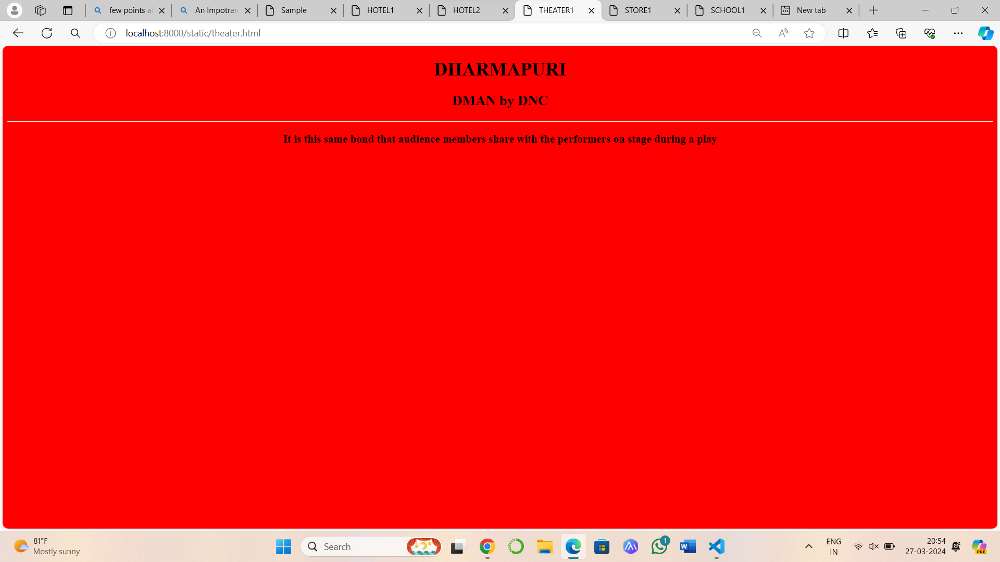

# Ex04 Places Around Me
## Date: 27.03.2024

## AIM
To develop a website to display details about the places around my house.

## DESIGN STEPS

### STEP 1
Create a Django admin interface.

### STEP 2
Download your city map from Google.

### STEP 3
Using ```<map>``` tag name the map.

### STEP 4
Create clickable regions in the image using ```<area>``` tag.

### STEP 5
Write HTML programs for all the regions identified.

### STEP 6
Execute the programs and publish them.

## CODE
```
map.html
<html>
    <head>
        <title>dharmapuri</title>
    </head>
    <body>
        <h1 align="center">
            <font color="black"><b>DHARMAPURI</b></font>
        </h1>
        <h3 align="center">
            <font color="red"><b>GAYATHRI (212223220024)</b></font>
        </h3>
        <center>
    <map name="dhar.py.png">
        <center>
        
    <area target="" alt="KFC" title="KFC" href="hotel.html" coords="" shape="rect">
    <area target="" alt="srirama hotel" title="srirama hotel" href="hotel.html" coords="" shape="rect">
    <area target="" alt="DMAN by DNC" title="DMAN by DNC" href="theaters.html" coords="" shape="poly">
    <area target="" alt="sree ranga department store" title="sree ranga department store" href="store.html" coords="NaN" shape="circle">
    <area target="" alt="sir vijay vidyashram senior secondary school" title="sir vijay vidyashram senior secondary school" href="school.html" coords="" shape="poly">
</map>
     </center>
   </body>
</html>

hotel.html
  <!DOCTYPE html>
<html lang="en">
<head>
    <title>HOTEL1</title>
</head>
<body bgcolor="blue">
    <h1><center>DHARMAPURI</center></h1>
  <h2><center>KFC</center></centre></h2>
  <hr>
  <h3><center>KFC have many branches in india and all over the world</center></h3>  
</body>
</html>

hotel2.html
  <!DOCTYPE html>
<html lang="en">
<head>
    <title>HOTEL2</title>
</head>
<body bgcolor="baby pink">
    <h1><center>DHARMAPUR</center></h1>
    <h2><center>srirama hotel</center></h2>
    <hr>
    <h3><center>srirama hotel is vegtarian hotel .It contains many food varity</center></h3>
    
</body>
</html>

theater.html
   <!DOCTYPE html>
<html lang="en">
<head>
    <title>THEATER1</title>
</head>
<body bgcolor="red">
<h1><center>DHARMAPURI</center></h1>
<h2><center>DMAN by DNC</center></h2>
<hr>
<h3><center>It is this same bond that audience members share with the performers on stage during a play</center></h3>

    
</body>
</html>

store.html
   <!DOCTYPE html>
<html lang="en">
<head>
    <title>STORE1</title>
</head>
<body bgcolor="purple">
    <h1><center>DHARMAPURI</center></h1>
    <h2><center>sree ranga department store</center></h2>
    <hr>
    <h3><center>it contain many stationary items,toys,kitchen items and snacks etc... </center></h3>
</body>
</html>

 school.html
   <!DOCTYPE html>
<html lang="en">
<head>
    <title>SCHOOL1</title>
</head>
<body bgcolor="sky blue">
    <h1><center>DHARMAPURI</center></h1>
    <h2><center>sir vijay vidyashram senior secondary school</center></h2>
    <hr>
    <h3><center>They provide good education to students and they motivate students to get good marks in exams.They also involved in sports and other activites  </center></h3>
</body>
</html>
  ```


## OUTPUT





## RESULT
The program for implementing image maps using HTML is executed successfully.
